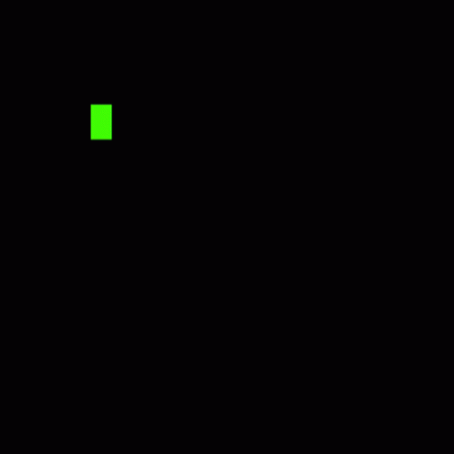
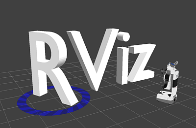
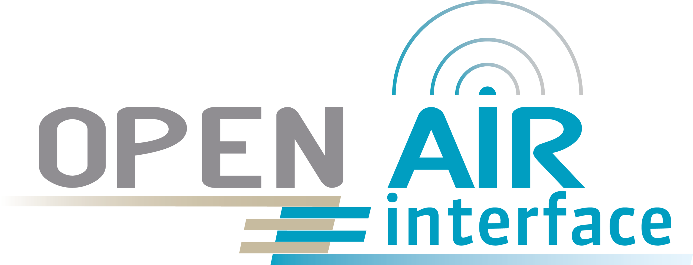
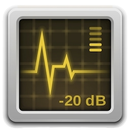
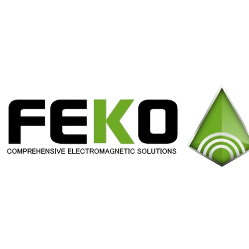
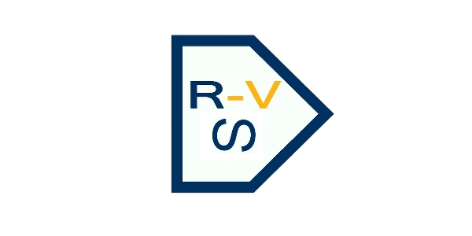
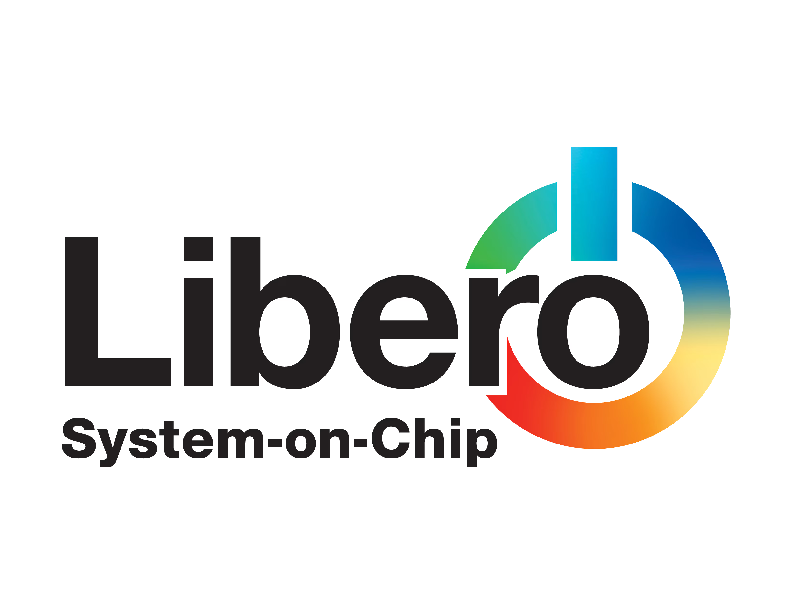

# <h1 align="center">Hi 👋, I'm Chaitanya Patange</h1>

<h3 align="center">
M.Tech Graduate | Satellite Communication | SDR | 5G/ 6G | UAV Communication
</h3>

  

  
  
  
  

# 👨‍💻 $WhoAmI (About Me)

<table border="0" style="border: none; border-collapse: collapse;">
<tr style="border: none;">
<td width="65%" valign="top" style="border: none;">

I am an engineer and researcher passionate about **satellite communication, space technology and building real-world wireless communication and networking systems**.

My interests include:

- 🛰️ **Satellite & Non-Terrestrial Networks (NTN)**
- 📡 **5G/6G & Open RAN**
- 📻 **Software Defined Radio (SDR)**
- 🚁 **UAV Communication Systems**
- ⚡ **GPU & CUDA Programming**
- 🤖 **AI/ML**

I enjoy turning ideas into **real-world systems using SDR and hardware**.

</td>

<td width="35%" align="center" style="border: none;">

<!--  -->

</td>
</tr>
</table>

# 🛠️ $ cat ~/.bashrc (Tech Stack)

### Programming

  
  
  

### AI / GPU Computing

### Robotics Systems

### Cloud & DevOps

### Networking & SDR

### RF & EM Simulation

### Circuit Simulation

### Networking

### FPGA

### MS Office

---

  <i>"Building communication systems that move from theory to real-world deployment."</i>

⭐ Feel free to explore my repositories and connect with me! ⭐

